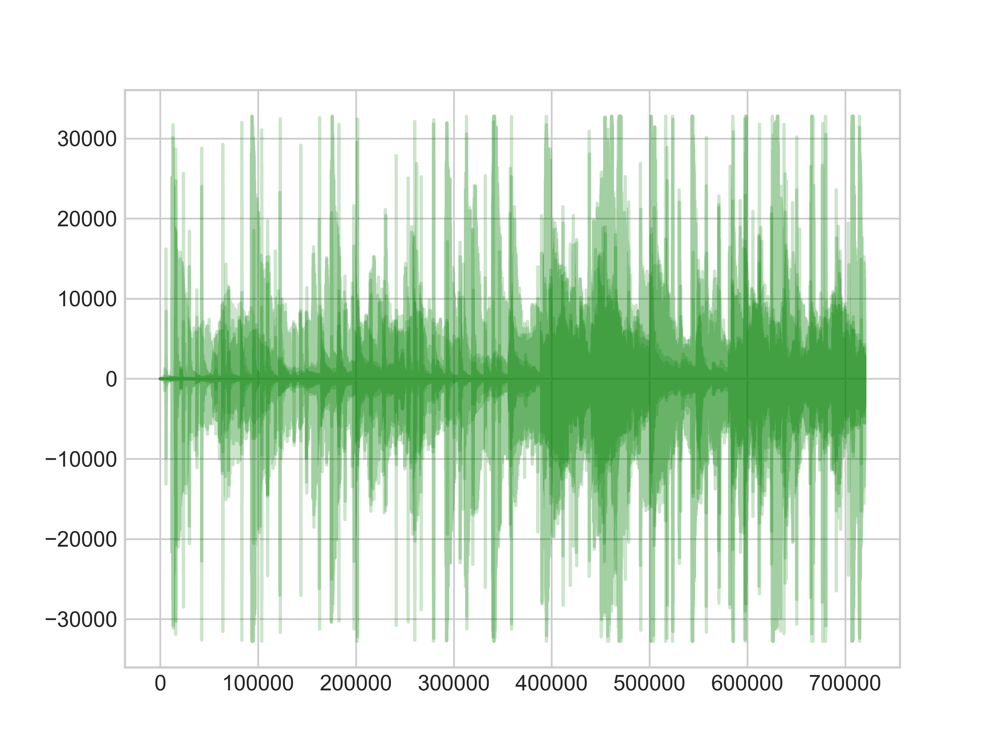

### Dynamic time warping
Dynamic time warping (DTW) is one of the algorithms for measuring similarity between two temporal sequences, which may vary in speed. The technique has relied on time series analysis and visual, audial data recognition systems. The advantage of using DTW is that reliable time alignment between reference and test patterns is obtained. The disadvantage of using DTW is the heavy computational burden required to find the optimal time alignment path.

### Pre-requisites
Install the fastdtw PyPi library, Python v2.7, packages: scipy.io, matplotlib, numpy

### Hypothesis
Dynamic time warping recognise synchronous patterns on the two audio streams- escobilla (footwork) and flamenco patterns of music (palos). In this project we will be comparing various audio recordings (in WAV files) based on the flamenco patterns, e.g. 30seconds of the Carmen Amaya dance Bulerias performance and three flamenco cantaores: Estrella Morente, Marina Heredia and Gema Jimenez. There are four audio clips where two of them are based on the Bulerias and one of Seguiriyas musical forms.

### Results
Estrella Morente Bulerias (15s): 1426938197.0
Marina Heredia Bulerias (15s): 2285134067.0
Gema Jimenez Seguirilla (15s): 2045553908.0

### Plots with two different scales
This project demonstrates how to do two plots on the same axes with different left and
right scales.

Difference between Dynamic Time Warping distance and Euclidean distance mapping audio signals in time series.
The former allows many-to-one point comparisons, while Euclidean one-to-one distance.

The red line represents waveform of audio sample with dynamic time interval between signals while the blue line represents frequencies with constant time scale.

Two independent y axes are mapped to x axis which represents intervals (sample count in time series).

The axes are generated by calling the Axes.twinx method. Likewise,
Axes.twiny is available to generate axes that share y axis but
have different top and bottom scales.

### Classification of Flamenco footwork exercise
In Flamenco dance, an escobilla is where the dancer does an extended section of zapateado (footwork).
The project analyze 10seconds record sample data of José Manuel Álvarez performance of Siguiriyas in 161bpm count and visualize on graph.
Siguiriyas is one of flamenco's most difficult dance forms, and a dancer's first job is to master the compás.
Siguiriyas pattern has two short, two long, and one short (counted as: 1 and 2 and 3 and a 4 and a 5 and):
The underlying compás for siguiriyas is a 12 count pattern with beats grouped as 2, 2, 3, 3, 2, and with an accent on the first beat of each group.
siguiriyas pattern has two short, two long, and one short (counted as: 1 and 2 and 3 and a 4 and 5).

### References:

")

")

